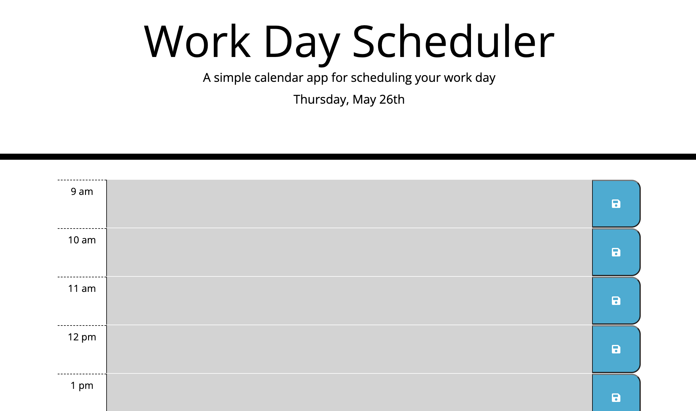

# Work-Day-Scheduler

This Work Day Scheduler application uses third party APIs to create a functioning schedule that one could use from a 9 am to 5 pm timeframe. Based on the time, this application has the functionality to highlight the current time block in red, the past time blocks in grey, and the future time blocks in green. Along with this, it has the capability of storing the user's input in local storage and also retrieving it after the user closes and comes back to the application in the future. Some tools used to create this project include Moment.js, jQuery, bootstrap, and much more!

## Screenshot

## Deploy Link

[Deployed link](https://kishanshah98.github.io/Work-Day-Scheduler/)

